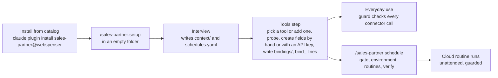
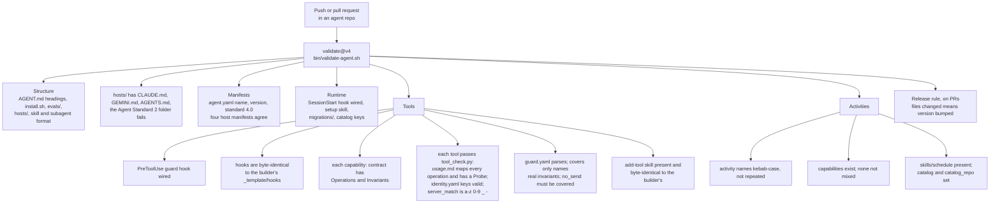
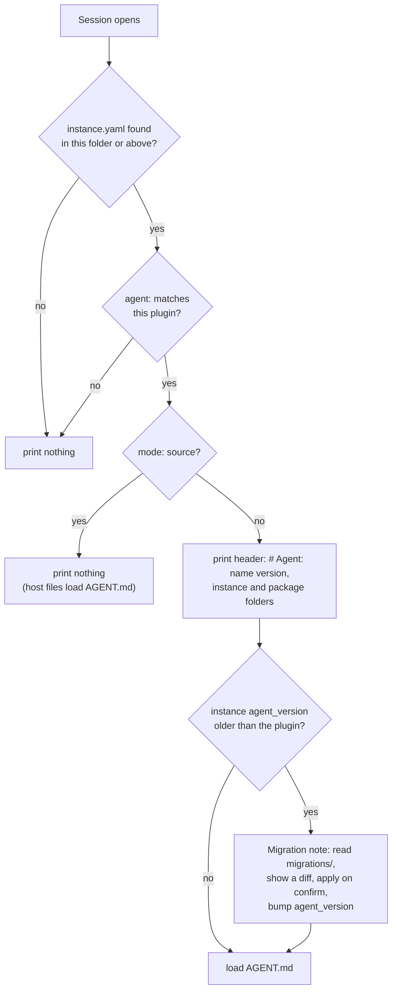
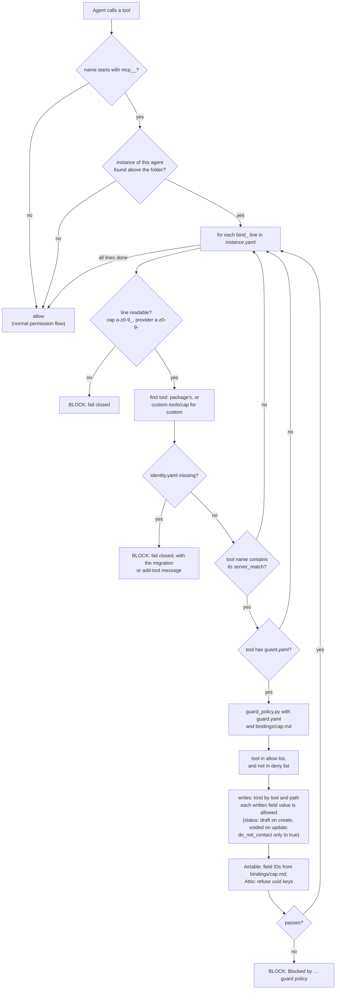
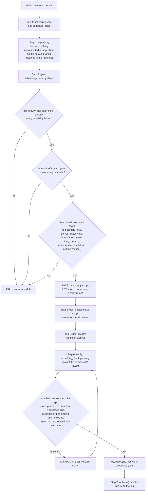
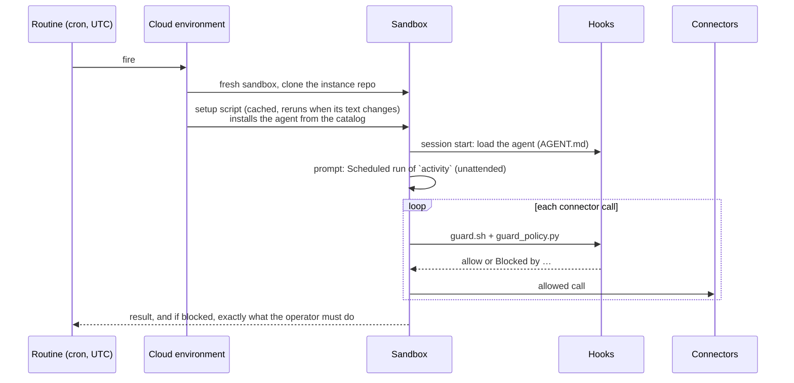

# How Webspenser agents work

A product overview of the moving parts: what they are, where they live, and
every check that runs, and when. Keep this page current: when a release
changes one of these parts, update the page in the same pull request.

Current: **Agent Standard 4.0**. Agent Builder 4.0.0, sales-partner 4.0.0.

- [The three repositories](#the-three-repositories)
- [Vocabulary](#vocabulary)
- [What an agent package holds](#what-an-agent-package-holds)
- [What a client's instance holds](#what-a-clients-instance-holds)
- [A client's journey](#a-clients-journey)
- [The checks](#the-checks)
  - [1. At publish time: the validator in CI](#1-at-publish-time-the-validator-in-ci)
  - [2. At run time: session start and the guard](#2-at-run-time-session-start-and-the-guard)
  - [3. At scheduling time: the schedule skill](#3-at-scheduling-time-the-schedule-skill)
  - [4. Inside a scheduled run](#4-inside-a-scheduled-run)
- [Custom tools: bringing your own tool](#custom-tools-bringing-your-own-tool)
- [Activities, in detail](#activities-in-detail)
- [Field IDs (Airtable), in detail](#field-ids-airtable-in-detail)
- [Known limits and open questions](#known-limits-and-open-questions)

## The three repositories

| Repository | Role |
|---|---|
| [`webspenser/agent-builder`](https://github.com/webspenser/agent-builder) | Defines the **Agent Standard** (`STANDARD.md`). It ships the reference files every agent copies (`_template/`), the validator (`bin/validate-agent.sh`), the GitHub Action `webspenser/agent-builder/validate@v4`, and the `new-agent` wizard. |
| [`webspenser/sales-partner`](https://github.com/webspenser/sales-partner) | An agent built to the standard: a five-stage sales pipeline over a CRM. |
| [`webspenser/agent-library`](https://github.com/webspenser/agent-library) | The **catalog**, a Claude Code plugin marketplace named `webspenser`, listing which agents can be installed. |

The builder's version and the standard's version move together. The `v3` tag
of the validate action points at the latest 3.x builder. Moving the tag is how
a new standard reaches every agent's CI.

## Vocabulary

| Term | Meaning | Where it lives |
|---|---|---|
| **Agent (package)** | What gets installed: instructions, skills, subagents, capabilities, hooks. | The agent's repository |
| **Instance** | One client's copy of the agent's state: their bindings, business context and schedules. It never holds agent code. | The client's own private repository |
| **Capability** | A kind of tool the agent needs, e.g. `crm`, `email_drafts`. | `capabilities/<cap>/` |
| **Contract** | The capability's operations plus its **invariants**, the rules that must always hold (e.g. `no_send`: never send email). | `capabilities/<cap>/contract.md` |
| **Tool** | How the contract maps onto one specific system (Attio, Airtable, HubSpot, Gmail). | `capabilities/<cap>/tools/<tool>/` |
| **Guard policy** | The tool's enforcement rules: which tool calls are allowed, which are denied, and which field values may be written. Its `covers` list names the invariants it enforces. | `…/tools/<tool>/guard.yaml` |
| **Binding** | The instance's choice of tool for a capability. | `bind_<cap>: <tool>` in `instance.yaml` |
| **Unattended-safe** | Every invariant of the contract is in the bound tool's `covers`: enforced by code, not only by instructions. | Computed by setup and the schedule checker |
| **Activity** | A workflow step that may run on a schedule, with no one watching. | `activity_<name>: <caps>` in `agent.yaml` |
| **Routine** | A Claude cloud job that runs one or more activities on a schedule. | claude.ai/code/routines |
| **Cloud environment** | Where a routine runs. Its setup script installs the agent (and with it, the guard). | claude.ai/code |

## What an agent package holds

```
agent.yaml                  name, version, standard, capabilities, catalog, activity_* lines
AGENT.md                    the agent's instructions (loaded at session start)
skills/  subagents/  templates/  samples/  evals/  migrations/
hosts/                      host pointer files (CLAUDE.md, GEMINI.md, AGENTS.md)
capabilities/<cap>/
  contract.md               operations + invariants
  tools/<tool>/
    usage.md                how the agent uses this tool, for the model to read
    identity.yaml           capability, provider, server_match, for the hooks to read
    guard.yaml              enforcement rules (optional, but required for no_send)
    bootstrap.py            optional one-time schema setup in the tool
hooks/                      identical in every agent (copied from the builder)
  hooks.json                wires the two hooks below into Claude Code
  session-start.sh          loads the agent when a session opens in an instance
  guard.sh                  runs before every connector (MCP) call
  guard_policy.py           the rules engine guard.sh calls
  schedule_check.py         the gate and verifier for scheduled runs
  tool_check.py             checks one tool folder against its contract
skills/add-tool/            adds a tool for a capability (an instance's own, or a new shipped one)
.claude-plugin/ .codex-plugin/ gemini-extension.json   host manifests
```

`usage.md` and `identity.yaml` serve different readers:

- **`identity.yaml`** is three keys that the hooks read:
  - `capability` and `provider` say which contract and which tool.
  - `server_match` is the text that identifies the tool's connector in a tool name (`mcp__Attio__update-record` contains `attio`).
- **`usage.md`** is prose that the model reads. For every contract operation, it gives the exact tool calls, field slugs, filters and views. It also has a `## Probe` section that setup runs when binding.

## What a client's instance holds

```
instance.yaml               agent, agent_version, mode (plugin|source), bind_<cap>: <tool>
bindings/<cap>.md           what setup's probe found: workspace, object IDs, field IDs
context/                    business-profile.md, icp.md, operating-config.md, samples/
schedules.yaml              timezone, schedule_*, then_*, environment, routine_*
custom-tools/<cap>/         only when the client brought their own tool (see below)
CLAUDE.md GEMINI.md AGENTS.md .claude/settings.json .gitignore
```

Credentials are never stored in any file. They live in the host: connectors,
MCP settings, environment variables.

## A client's journey



The tools step can also create a tool's fields. If the probe finds them
missing, setup offers two choices: create them yourself from the tool's
`## Setup` list, or run the tool's `bootstrap.py` with an API key in
your own terminal. The key never enters the chat or any file. The
probe runs again and must pass before the tool is bound.

## The checks

There are four places where something checks your work. Each one protects a
different moment.

| When | What runs it | What it protects | On failure |
|---|---|---|---|
| Publish (PR / push) | `validate@v4` in the agent's CI | The package follows the standard; the hooks are the exact reference copies; every tool passes tool_check.py; guard policies parse | CI fails; the PR can't merge |
| Session start | `session-start.sh` | The right agent loads for this instance; a version upgrade triggers a migration | It prints nothing (wrong folder) or a migration note |
| Every connector call | `guard.sh` + `guard_policy.py` | The contract's invariants hold on real tool calls | The call is blocked with `Blocked by …` |
| Scheduling | `/…:schedule` skill + `schedule_check.py` | Only unattended-safe activities get scheduled; the routine is set up exactly as intended | The activity FAILs or the routine shows a MISMATCH; nothing is recorded |

### 1. At publish time: the validator in CI



The validator checks the **package** only. It never sees a client's instance,
bindings or schedules. Those are checked by the schedule skill, and by the
guard at run time.

### 2. At run time: session start and the guard

Session start runs once, when a session opens:



This is the **only version check at run time**. The guard does not look at
versions. It looks at bindings and policies.

The guard runs before every connector call:



Two design rules apply throughout:

- **Fail closed.** If the guard can't read something it needs (a garbled
  binding line, a broken policy, a missing engine), it blocks. It never
  allows by default.
- **Silence outside the instance.** Outside a folder bound to this agent, the
  guard does nothing, so it never gets in the way of unrelated work.

A connector that no binding matches is **not guarded** at all. That's
fine interactively, because Claude Code asks permission. It is the reason
scheduled routines must carry only the bound connectors (see below).

### 3. At scheduling time: the schedule skill



The first time `verify` runs there is no recorded environment yet. It
shows the routine's environment id, and the user confirms it is the one
with the setup script. Then `environment:` is recorded. Environment ids
can't be listed through the API, so this confirmation is the check.

The gate runs **only when the skill runs**. After you change bindings,
`schedules.yaml`, the agent version or the environment, run the skill
again.

### 4. Inside a scheduled run



Behavior verified in acceptance on 2026-09-29:

- The routine form takes the browser's local time and stores a fixed UTC
  cron, so the time shifts by an hour when daylight saving changes.
- `next_run_at` carries about a minute of jitter. `verify` allows for it.
- Connectors appear as `mcp__Attio__…` and `mcp__Gmail__…`.
- The agent loads only through the environment's setup script. Routines
  ignore plugins that the repository's `.claude/settings.json` enables.

## Custom tools: bringing your own tool

A client whose system has no shipped tool doesn't write a new contract.
The contract is part of the agent. The client adds a new tool for the
same capability, and the capability slug stays the same.

**How:** the `add-tool` skill, which every agent ships. Setup's **tools
step** (step 9) runs it when the client says none of the shipped tools
fits, and the client can run it later on its own. In an instance
(the **instance** target), it:

1. Asks which capability and which system, finds that system's MCP tools
   in the session, and proposes a `server_match`.
2. Writes the instance's `custom-tools/<cap>/`:
   - `identity.yaml` with `provider: custom`;
   - `usage.md`, mapping every contract operation, with a `## Probe`;
   - a `guard.yaml` for each invariant the client wants enforced by code.
3. Checks the folder with `tool_check.py --custom` until it prints `OK`.
4. Runs the probe, writes `bindings/<cap>.md`, and sets `bind_<cap>: custom`.
5. Reports each invariant as covered or instruction-only, and offers the
   `schedule` skill again if there are schedules.

It never writes credentials: logins stay in the host's connectors. To
change a custom tool later, run `add-tool` again for that capability.

From then on, the guard and the schedule checker treat `custom` exactly
like a shipped tool. They read its `identity.yaml` and `guard.yaml` from
`custom-tools/<cap>/`. If its `guard.yaml` doesn't cover every invariant,
the capability isn't unattended-safe, so its activities can't be scheduled.
For email, setup and `add-tool` refuse to bind it unless `no_send` is
covered. The guard doesn't re-check this at call time: it can't see the
contract, so hand-edited files that skip it are a known gap (see "Guard
policy" in the Agent Standard). If a
bound tool has no `identity.yaml`, the guard blocks every connector call
until it is fixed.

The **package** target of the same skill adds a new shipped tool in
`capabilities/<cap>/tools/<tool>/` in the agent's own repository, for a
pull request.

Current limits:

- An instance can have only one custom tool per capability.
- The validator never sees custom tools. Only `tool_check.py`, the guard
  and the schedule gate do.
- A custom tool that proves useful to others should become a shipped
  tool in the agent's package, through a pull request.

## Activities, in detail

`activity_<name>: <capabilities>` in `agent.yaml` is the agent author's
declaration: *"this workflow step may run with no one watching, and it only
touches these capabilities."* For sales-partner:

```yaml
activity_prospect: crm
activity_prepare: crm
activity_approach: crm, email_drafts
activity_follow-up: crm, email_drafts
activity_digest: crm, email_drafts
```

- **The author** declares which steps can be scheduled. Undeclared steps can
  never be scheduled.
- **The client** chooses when, in `schedules.yaml`
  (`schedule_digest: "Monday 08:00"`). `then_prospect: prepare` runs
  `prepare` straight after `prospect`, in the same routine.
- **The gate** checks the capabilities the author declared against the
  client's bindings.
- `none` means the step touches no capability, e.g. a pure-research step.

Web search and file reads are not capabilities, so activities don't list
them.

## Field IDs (Airtable), in detail

Attio's tools write fields by **name** (`status`, `do_not_contact`), so its
guard policy can check those names directly. Airtable's tools write fields
by **ID** (`fldXXXXXXXX`). A policy that said "field Status" would never
match a call, and renaming the column in Airtable would also get around a
rule keyed on the name.

So the Airtable policy's rules say `binding_id: required`. Setup's probe
records the real IDs in `bindings/crm.md`:

```
field_status: fldAbc123
field_do_not_contact: fldDef456
```

The engine checks writes against those IDs. If the lines are missing, every
Airtable write is blocked. That fails safe, but it surprises users; making
the gate flag it earlier is on the list below.

**The balance.** The guard enforces only the few invariants that would do
real harm if broken:

- never approve or send outreach (`draft_only`);
- never clear Do Not Contact (`dnc_one_way`);
- never delete or merge (`no_delete`);
- never send email (`no_send`).

Everything else is left to the agent's instructions.

## Known limits and open questions

Engineering follow-ups:

- **No re-check at run time.** The gate runs only when the schedule skill
  runs. A hook at the start of each scheduled run would catch binding or
  version drift.
- **Unpinned version.** When the setup script's cache refreshes, the
  environment installs the latest catalog version. Nothing pins a version.
- **Time zones.** The skill should give the routine time in the user's
  browser zone, because the form uses that zone.
- **Exact times.** The routine UI suggests times just off the hour, but
  `verify` compares exact times. Decide whether to allow a margin or keep
  the rule "use the exact time".
- **Source-mode instances** still need `catalog` keys to schedule, and get
  install lines they don't need.
- **Scheduled prospecting** uses web search only. Apify would need a
  scraping capability.
- **Airtable without field IDs** passes the gate but blocks every write.

Design questions:

- **Compliance** (CAN-SPAM, GDPR, TCPA) as a first-class track, and which
  tools to build next.
