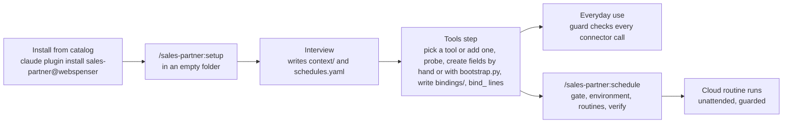
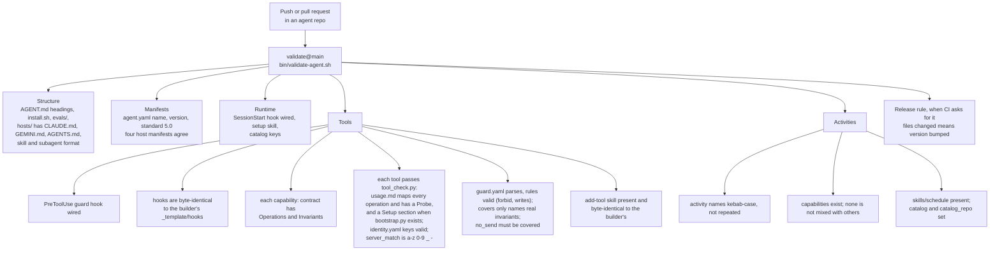
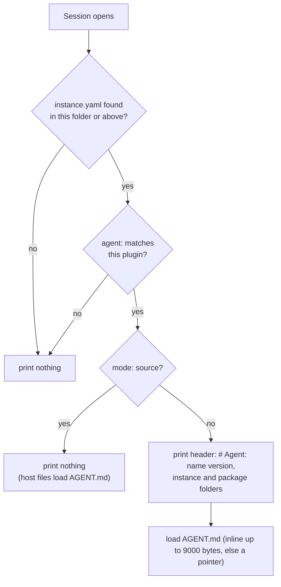
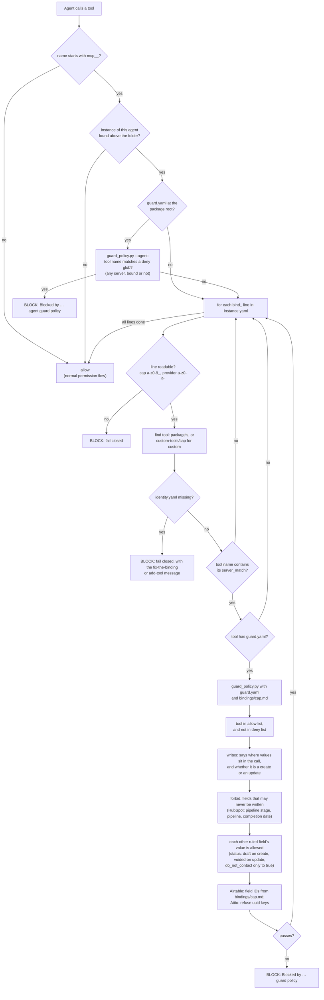
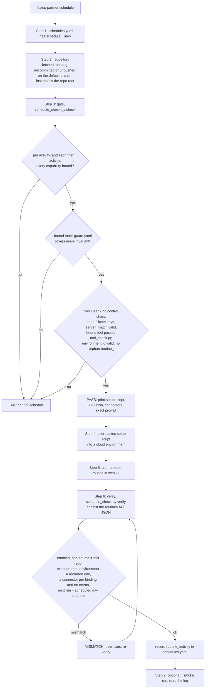
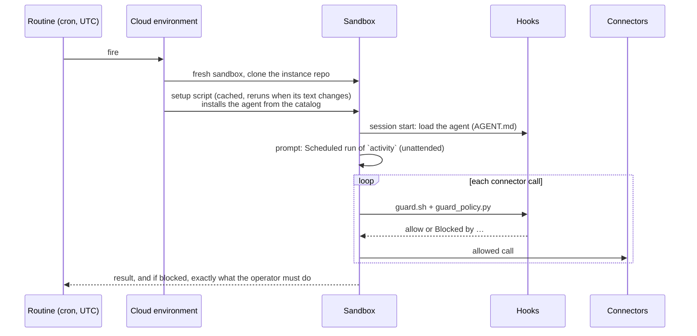

# How Webspenser agents work

A product overview of the moving parts: what they are, where they live, and
every check that runs, and when. Keep this page current: when a release
changes one of these parts, update the page in the same pull request.

Current: standard 5.0. Agent Builder 5.0.0, sales-partner 5.0.0.

- [The three repositories](#the-three-repositories)
- [Vocabulary](#vocabulary)
- [What an agent package holds](#what-an-agent-package-holds)
- [What a client's instance holds](#what-a-clients-instance-holds)
- [A client's journey](#a-clients-journey)
- [CRM tools at a glance](#crm-tools-at-a-glance)
- [The checks](#the-checks)
  - [1. At publish time: the validator in CI](#1-at-publish-time-the-validator-in-ci)
  - [2. At run time: session start and the guard](#2-at-run-time-session-start-and-the-guard)
  - [3. At scheduling time: the schedule skill](#3-at-scheduling-time-the-schedule-skill)
  - [4. Inside a scheduled run](#4-inside-a-scheduled-run)
- [Custom tools: bringing your own tool](#custom-tools-bringing-your-own-tool)
- [Activities, in detail](#activities-in-detail)
- [Field names and IDs, in detail](#field-names-and-ids-in-detail)
- [Known limits and open questions](#known-limits-and-open-questions)

## The three repositories

| Repository | Role |
|---|---|
| [`webspenser/agent-builder`](https://github.com/webspenser/agent-builder) | Defines the **Agent Standard** (`STANDARD.md`). It ships the reference files every agent copies (`_template/`), the validator (`bin/validate-agent.sh`), the GitHub Action `webspenser/agent-builder/validate@main`, and the `new-agent` wizard. |
| [`webspenser/sales-partner`](https://github.com/webspenser/sales-partner) | An agent built to the standard: a five-stage sales pipeline over a CRM. |
| [`webspenser/agent-library`](https://github.com/webspenser/agent-library) | The **catalog**, a Claude Code plugin marketplace named `webspenser`, listing which agents can be installed. |

The builder's version and the standard's version move together. The standard is in active development, so there are no version tags yet. An agent's CI uses `validate@main` and always checks against the latest standard. Tags come with the first official release. There is no migration machinery: a change to the standard is made directly in the agents.

## Vocabulary

| Term | Meaning | Where it lives |
|---|---|---|
| **Agent (package)** | What gets installed: instructions, skills, subagents, capabilities, hooks. | The agent's repository |
| **Instance** | One client's copy of the agent's state: their bindings, business context and schedules. It never holds agent code. | The client's own private repository |
| **Capability** | A kind of tool the agent needs, e.g. `crm`, `email_drafts`. | `capabilities/<cap>/` |
| **Contract** | The capability's operations plus its **invariants**, the rules that must always hold (e.g. `no_send`: never send email). | `capabilities/<cap>/contract.md` |
| **Tool** | How the contract maps onto one specific system (Attio, Airtable, HubSpot, Gmail). | `capabilities/<cap>/tools/<tool>/` |
| **Guard policy** | The tool's enforcement rules: which tool calls are allowed, which are denied, which field values may be written, and which fields may never be written at all. Its `covers` list names the invariants it enforces. | `…/tools/<tool>/guard.yaml` |
| **Binding** | The instance's choice of tool for a capability. | `bind_<cap>: <tool>` in `instance.yaml` |
| **Unattended-safe** | Every invariant of the contract is in the bound tool's `covers`: enforced by code, not only by instructions. | Computed by setup and the schedule checker |
| **Activity** | A workflow step that may run on a schedule, with no one watching. | `activity_<name>: <caps>` in `agent.yaml` |
| **Routine** | A Claude cloud job that runs one or more activities on a schedule. | claude.ai/code/routines |
| **Cloud environment** | Where a routine runs. Its setup script installs the agent (and with it, the guard). | claude.ai/code |

## What an agent package holds

```
agent.yaml                  name, version, description, standard, capabilities, catalog, activity_* lines
AGENT.md                    the agent's instructions (loaded at session start)
skills/  subagents/  templates/  samples/  evals/
hosts/                      host pointer files (CLAUDE.md, GEMINI.md, AGENTS.md)
capabilities/<cap>/
  contract.md               operations + invariants
  tools/<tool>/
    usage.md                how the agent uses this tool, for the model to read
    identity.yaml           capability, provider, server_match, for the hooks to read
    guard.yaml              enforcement rules (optional, but required for no_send)
    bootstrap.py            optional one-time field setup, run by the person with their own API key
hooks/                      identical in every agent (copied from the builder)
  hooks.json                wires the two hooks below into Claude Code
  session-start.sh          loads the agent when a session opens in an instance
  guard.sh                  runs before every connector (MCP) call
  guard_policy.py           the rules engine guard.sh calls
  schedule_check.py         the gate and verifier for scheduled runs
  tool_check.py             checks one tool folder against its contract
skills/add-tool/            adds a tool for a capability (an instance's own, or a new shipped one)
.claude-plugin/ .codex-plugin/ gemini-extension.json   host manifests
```

`usage.md` and `identity.yaml` serve different readers:

- **`identity.yaml`** is three keys that the hooks read:
  - `capability` and `provider` say which contract and which tool.
  - `server_match` is the text that identifies the tool's connector in a tool name (`mcp__Attio__update-record` contains `attio`).
- **`usage.md`** is prose that the model reads. For every contract operation, it gives the exact tool calls, field slugs, filters and views. It also has a `## Probe` section that setup runs when binding.

## What a client's instance holds

```
instance.yaml               agent, mode (plugin|source), bind_<cap>: <tool>
bindings/<cap>.md           what setup's probe found: workspace, object IDs, field IDs
context/                    business-profile.md, icp.md, operating-config.md, samples/
schedules.yaml              timezone, schedule_*, then_*, environment, routine_*
custom-tools/<cap>/         only when the client brought their own tool (see below)
CLAUDE.md GEMINI.md AGENTS.md .claude/settings.json .gitignore
```

Credentials are never stored in any file. They live in the host: connectors,
MCP settings, environment variables.

## A client's journey



The tools step can also help create a tool's fields. If the probe finds
them missing, setup offers two choices:

- **By hand.** Setup shows the tool's `## Setup` list as plain steps in
  that system, and you create the fields yourself.
- **With `bootstrap.py`.** Only tools that ship the script offer this
  (today, Attio and HubSpot). You create an API key in that system and run
  the script in your own terminal. You type the key at a hidden prompt
  (`read -rs`), so it never appears on screen or in your shell history. It
  stays in that terminal's environment only. It never enters the chat or
  any file. The script only adds what is missing and never deletes or
  renames anything.

Either way, the probe runs again and must pass before the tool is bound.

## CRM tools at a glance

The `crm` capability ships three tools in sales-partner. All three follow
the same contract, so the pipeline works the same way on each. Only the
home of each record differs.

| | Attio | Airtable | HubSpot |
|---|---|---|---|
| **Lead** | A company record, plus one entry in the list `sales_partner_pipeline` | A row in the Leads table | A Company |
| **Contact** | A People record | A row in the Contacts table | A Contact, linked to its company |
| **Research** | An entry in the list `sales_partner_research` | A row in the Research table | A Note on the company |
| **Activity (a draft or logged interaction)** | An entry in the list `sales_partner_outreach` | A row in the Activities table | A Task on the company (and contact) |
| **Where draft / approved / sent / voided lives** | The `status` field on the entry | The `Status` field on the row | HubSpot's built-in task status: Not started = draft, In progress or Waiting = approved, Completed = sent, Deferred = voided |
| **Outbound or inbound** | The `direction` field | The `Direction` field | The built-in task priority: High = outbound, None = inbound |
| **Approval queue** | The view "Awaiting Approval" on the outreach list: status is draft and direction is outbound | The view "Awaiting Approval" on Activities: Status is draft and Direction is outbound | A Tasks view: status is Not started and priority is High |
| **What setup needs** | An API key, to run `bootstrap.py` (or create the lists and fields by hand) | Create the four tables by hand. No script. Setup's probe records two field IDs | 16 custom fields on Companies and Contacts (none on Tasks). Run `bootstrap.py` with a private-app token, or create them by hand |
| **Guard blocks, on top of the shared rules** | Attribute keys given as IDs | Writes with no recorded field IDs | Writing a pipeline stage, pipeline or completion date on a Task |

In every tool, the agent can only create a draft or void one. Approving
and sending are done by a person, in the CRM. The operator creates the
saved views by hand, because none of the connectors can create views.

In HubSpot, a lead's location uses HubSpot's own city, state and country
fields, so it needs no custom field. HubSpot's Tasks work on the free
tier because drafts use the built-in task status. Each tool's setup list
and views are in its `usage.md` under `capabilities/crm/tools/` in the
sales-partner repository.

## The checks

There are four places where something checks your work. Each one protects a
different moment.

| When | What runs it | What it protects | On failure |
|---|---|---|---|
| Publish (PR / push) | `validate@main` in the agent's CI | The package follows the standard; the hooks are the exact reference copies; every tool passes tool_check.py; guard policies parse | CI fails; the PR can't merge |
| Session start | `session-start.sh` | The right agent loads for this instance | It prints nothing (wrong folder) |
| Every connector call | `guard.sh` + `guard_policy.py` | The contract's invariants hold on real tool calls | The call is blocked with `Blocked by …` |
| Scheduling | `/…:schedule` skill + `schedule_check.py` | Only unattended-safe activities get scheduled; the routine is set up exactly as intended | The activity FAILs or the routine shows a MISMATCH; nothing is recorded |

### 1. At publish time: the validator in CI



The validator checks the **package** only. It never sees a client's instance,
bindings or schedules. Those are checked by the schedule skill, and by the
guard at run time.

### 2. At run time: session start and the guard

Session start runs once, when a session opens:



Nothing at run time compares versions. The guard looks at bindings and
policies.

The guard runs before every connector call:



Two design rules apply throughout:

- **Fail closed.** If the guard can't read something it needs (a garbled
  binding line, a broken policy, a missing engine), it blocks. It never
  allows by default.
- **Silence outside the instance.** Outside a folder bound to this agent, the
  guard does nothing, so it never gets in the way of unrelated work.

A connector that no binding matches is **not guarded** at all. That's
fine interactively, because Claude Code asks permission. It is the reason
scheduled routines must carry only the bound connectors (see below).

### 3. At scheduling time: the schedule skill



The first time `verify` runs there is no recorded environment yet. It
shows the routine's environment id, and the user confirms it is the one
with the setup script. Then `environment:` is recorded. Environment ids
can't be listed through the API, so this confirmation is the check.

The gate runs **only when the skill runs**. After you change bindings,
`schedules.yaml`, the agent version or the environment, run the skill
again.

### 4. Inside a scheduled run



Behavior verified in acceptance on 2026-09-29:

- The routine form takes the browser's local time and stores a fixed UTC
  cron, so the time shifts by an hour when daylight saving changes.
- `next_run_at` carries about a minute of jitter. `verify` allows for it.
- Connectors appear as `mcp__Attio__…` and `mcp__Gmail__…`.
- The agent loads only through the environment's setup script. Routines
  ignore plugins that the repository's `.claude/settings.json` enables.

## Custom tools: bringing your own tool

A client whose system has no shipped tool doesn't write a new contract.
The contract is part of the agent. The client adds a new tool for the
same capability, and the capability slug stays the same.

**How:** the `add-tool` skill, which every agent ships. Setup's **tools
step** (step 9) runs it when the client says none of the shipped tools
fits, and the client can run it later on its own. In an instance
(the **instance** target), it:

1. Asks which capability and which system, finds that system's MCP tools
   in the session, and proposes a `server_match`.
2. Writes the instance's `custom-tools/<cap>/`:
   - `identity.yaml` with `provider: custom`;
   - `usage.md`, mapping every contract operation, with a `## Probe`;
   - a `guard.yaml` for each invariant the client wants enforced by code.
3. Checks the folder with `tool_check.py --custom` until it prints `OK`.
4. Runs the probe, writes `bindings/<cap>.md`, and sets `bind_<cap>: custom`.
5. Reports each invariant as covered or instruction-only, and offers the
   `schedule` skill again if there are schedules.

It never writes credentials: logins stay in the host's connectors. To
change a custom tool later, run `add-tool` again for that capability.

From then on, the guard and the schedule checker treat `custom` exactly
like a shipped tool. They read its `identity.yaml` and `guard.yaml` from
`custom-tools/<cap>/`. If its `guard.yaml` doesn't cover every invariant,
the capability isn't unattended-safe, so its activities can't be scheduled.
For email, setup and `add-tool` refuse to bind it unless `no_send` is
covered. At call time the agent guard policy's deny list (the
package-root `guard.yaml`) covers a custom email tool too, whatever its
own files say. If a
bound tool has no `identity.yaml`, the guard blocks every connector call
until it is fixed.

The **package** target of the same skill adds a new shipped tool in
`capabilities/<cap>/tools/<tool>/` in the agent's own repository, for a
pull request.

Current limits:

- An instance can have only one custom tool per capability.
- The validator never sees custom tools. Only `tool_check.py`, the guard
  and the schedule gate do.
- A custom tool that proves useful to others should become a shipped
  tool in the agent's package, through a pull request.

## Activities, in detail

`activity_<name>: <capabilities>` in `agent.yaml` is the agent author's
declaration: *"this workflow step may run with no one watching, and it only
touches these capabilities."* For sales-partner:

```yaml
activity_prospect: crm
activity_prepare: crm
activity_approach: crm, email_drafts
activity_follow-up: crm, email_drafts
activity_digest: crm, email_drafts
```

- **The author** declares which steps can be scheduled. Undeclared steps can
  never be scheduled.
- **The client** chooses when, in `schedules.yaml`
  (`schedule_digest: "Monday 08:00"`). `then_prospect: prepare` runs
  `prepare` straight after `prospect`, in the same routine.
- **The gate** checks the capabilities the author declared against the
  client's bindings.
- `none` means the step touches no capability, e.g. a pure-research step.

Web search and file reads are not capabilities, so activities don't list
them.

## Field names and IDs, in detail

Each tool writes to its CRM in a different way, and the guard has to
recognise a protected field in each of them.

- **Attio** writes fields by **name** (`status`, `do_not_contact`), so
  its guard policy can check those names directly. It also refuses any
  key that looks like an Attio ID, because an ID could hide a protected
  field.
- **HubSpot** writes properties by **name** too (`hs_task_status`,
  `sp_do_not_contact`). Its binding holds no field IDs, only the
  account's `hub_id`.
- **Airtable** writes fields by **ID** (`fldXXXXXXXX`). A policy that said
  "field Status" would never match a call, and renaming the column in
  Airtable would also get around a rule keyed on the name.

So setup's probe records the ID of every field in the agent's Airtable
tables in `bindings/crm.md`, one plain line each (a name used in two
tables gets two lines):

```
field_status: fldAbc123
field_do_not_contact: fldDef456
field_lead: fldGhi789
field_lead: fldJkl012
```

The Airtable policy says `bound_keys_only: true`: a write may use only
those recorded IDs. The rules for `Status` and `Do Not Contact` match
their IDs, and any other key is refused. That closes two holes. A
column deleted and recreated in Airtable gets a new ID, and that ID is
refused until the probe runs again, so the rule can't be dodged. And
with no IDs recorded, every Airtable write is blocked. Both fail safe:
the agent re-runs the probe and retries once.

**The rules a policy can hold.** Each rule names one field and does one of
these things:

- **Limit its values.** The field may be written only as the listed
  values, and the list can differ for a create and an update. Example:
  `status` may be created only as `draft` and updated only to `voided`.
- **Forbid it.** With `forbid: true`, the field may never be written, on
  create or update, whatever the value. HubSpot uses this for
  `hs_pipeline_stage`, `hs_pipeline` and `hs_task_completion_date`. A
  Task's pipeline stages mirror its statuses, so these fields would be
  another way to change a draft's status.
- **Freeze it after create.** With `forbid: update`, the field can be set
  when the record is created and never changed after. Every CRM tool
  uses this for the draft's body (`draft_body`, `Draft Body`,
  `hs_task_body`), so an approved draft can't be rewritten before it
  goes out. HubSpot records a voided draft's outcome as a Note instead
  of editing the Task.

**One deny list for the whole agent.** A tool's policy only fires for
calls to its own server. An agent can also ship a `guard.yaml` at its
package root: a deny-only list (sales-partner: `*send*`, `*reply*`,
`*forward*`, `*publish*`, and a few named posting tools) that the guard
applies to every MCP call in the instance, whatever the server. So a
Slack or social connector the client happens to have connected can't
send for the agent either, and a hand-made custom tool is covered too.
Any agent with a `no_send` capability must ship it. It matches tool
names, not what a tool does, so the list is checked against the read
tools of common connectors.

A policy's `writes:` list tells the engine where in each tool call the
values sit (for example `createRequest.objects[].properties` for a
HubSpot create) and whether that tool creates or updates. Without it the
engine would not know which values to check.

**The balance.** The guard enforces only the few invariants that would do
real harm if broken:

- never approve or send outreach (`draft_only`);
- never clear Do Not Contact (`dnc_one_way`);
- never delete or merge (`no_delete`);
- never send email (`no_send`).

Everything else is left to the agent's instructions.

## Known limits and open questions

These are still open. Everything else that used to be on this list is done.

- **Routine times and time zones.** The routine form uses the browser's
  time zone and stores a fixed UTC cron. The schedule skill should give
  times in the user's own zone.
- **Exact times.** The routine form suggests times just off the hour, but
  `verify` compares exact times. Decide whether to allow a margin or keep
  the rule "use the exact time".
- **Source-mode instances** still need the `catalog` keys to schedule, and
  they get install lines they don't need.
- **Airtable without field IDs.** A binding with no field IDs passes the
  schedule gate but blocks every write.
- **Catalog version pinning before go-live.** When the setup script's
  cache refreshes, the cloud environment installs the latest catalog
  version. Nothing pins a version yet, so a client could get a new
  release they have not seen. This needs fixing before agents go live
  for clients.
- **A run-time re-check for scheduled runs.** The gate runs only when the
  schedule skill runs. A check at the start of each scheduled run would
  catch binding or version drift that happens afterwards.
- **Compliance.** CAN-SPAM, GDPR and TCPA are not yet a first-class
  track in the standard.
- **More CRMs.** Attio, Airtable and HubSpot ship today. Which tool to
  build next is undecided.
- **A scraping capability.** Scheduled prospecting uses web search only.
  A service such as Apify would need its own capability.
- **Connector-driven field setup.** Fields are created by hand or with
  `bootstrap.py` and the person's own API key, because the connectors
  can't create fields or views. If connectors gain that ability, setup
  could do it without an API key.
- **The custom `no_send` tool gap.** `add-tool`, `tool_check.py` and the
  schedule gate refuse a custom email tool whose guard doesn't cover
  `no_send`. The guard itself can't see the contract, so a hand-edited
  instance that skips this isn't blocked at call time.
- **Guard support on Gemini and Codex.** The guard's hook wiring
  (`hooks/hooks.json`) is Claude Code's. The Gemini and Codex manifests
  ship but are not verified, so the guard isn't confirmed to run there.
